# advanced-linux-commands
## File Persmission Commands
### chmod: 

Allows you to change the permissions of a file or directory.

I created a file name script.sh and check for the permission of the file using the command `ls -l script.sh`. 

The output is -rw-r--r-- which means the file has read and write permission for the owner and only read permission for the group and others.

To assign execute permission for all user classes to the file, I used the command `chmod +x script.sh`.

The script.sh file now has execute permission for all user classes.

The same was achieved by using the numbers command `chmod 755 script.sh`.

To allow all group members read, write and execute permission, I used the command `chmod 777 script.sh`.

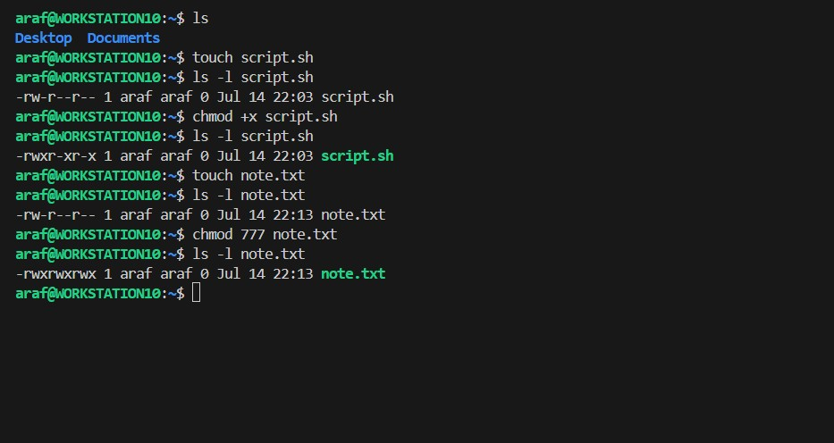

### chown: 

Allows you to change the owner of a file or directories, or symbolic links to a specified username or group.

For example, to change the owner of a file to a specified usernam and group, you can use the command `chown username:group filename`.

in this case, I used the file named note.txt and changed the owner to root and group to root using the command `chown root:root note.txt`.

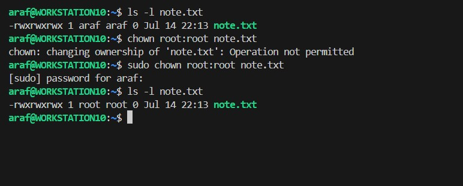

## Superuser Privileges
superuser allows you temporary access to perform administrative tasks that require elevated privileges.

Switch to root user with the command `sudo -i` and `exit` to leave the root user.
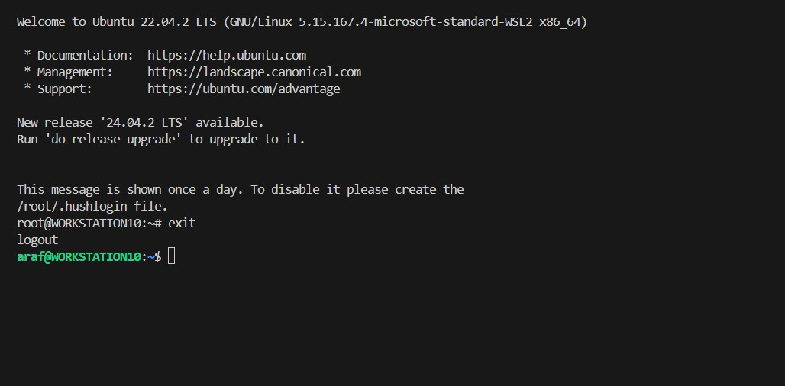

## User Management on Linux
### Creating a User

A new user was created using the command `sudo adduser johndoe`

### Granting Administrative Privileges

grant admin privileges to the newly created user using the command `sudo usermod -aG sudo johndoe`. This command add the user johndoe to the sudo group.
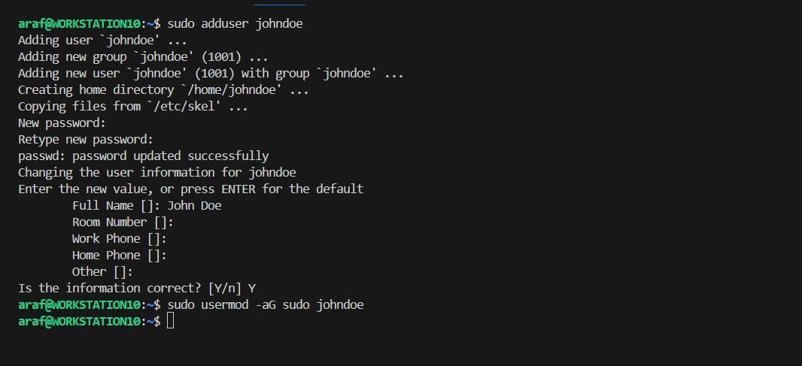

## Task
### Switching User Accounts

run the command `sudo su - johndoe` to switch to the johndoe user account. and navigate to the home directory using the command `cd /home/johndoe`.

### Modifying User Accounts
#### Changing User Password
To change the password of the johndoe user, run the command `sudo passwd johndoe`.

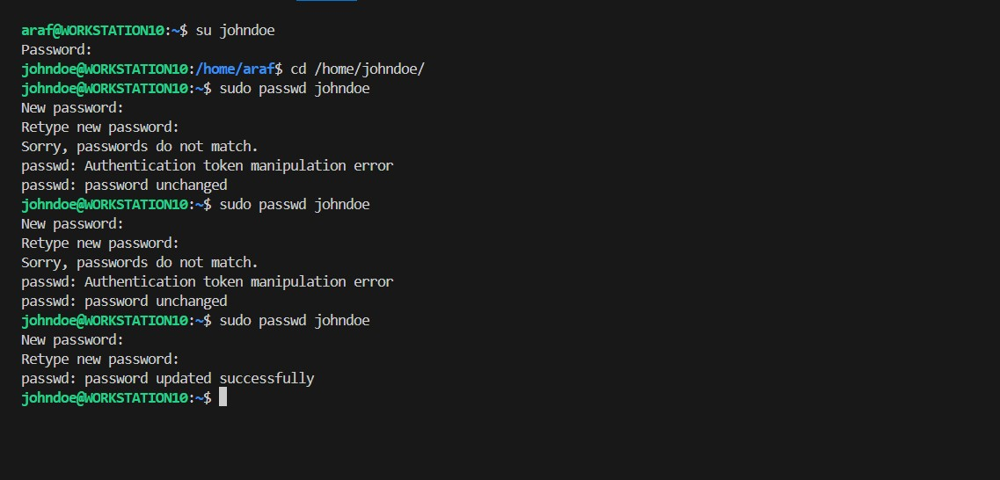

#### Creating User Group
To create a new group named developers, run the command `sudo groupadd developers`.

#### Adding User to Group
To add the johndoe user to the developers group, run the command `sudo usermod -aG developers johndoe`.

#### Deleting a User
To delete the johndoe user, run the command `sudo userdel johndoe`.
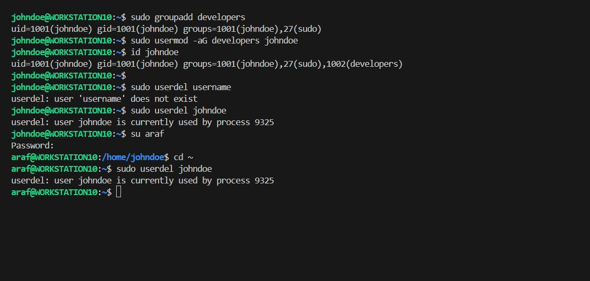

## Ensuring Proper Group Permissions
To ensure proper group permissions, run the command `sudo chown :developers /home/araf/Desktop`.

And grant read and write permissions to the group developers using the command `sudo chmod g+rw /home/araf/script.sh`.

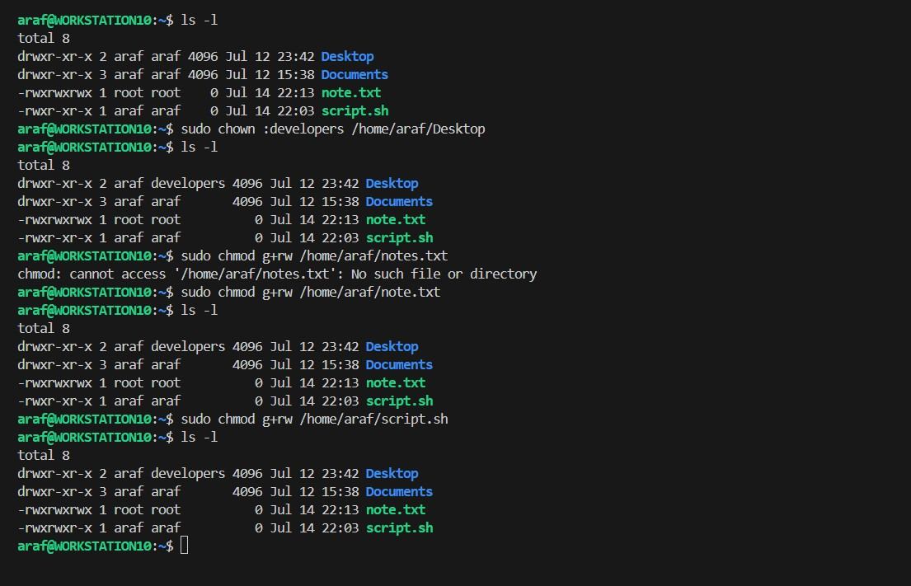

## Side Hustle Task 3

Create a group called `devops` using the command `sudo groupadd devops`.

Create  users `["mary","mohammed","ravi","tunji","sofia"]` using the command `sudo useradd mary mohammed ravi tunji sofia` and assign them a password using the command `sudo passwd mary mohammed ravi tunji sofia`.
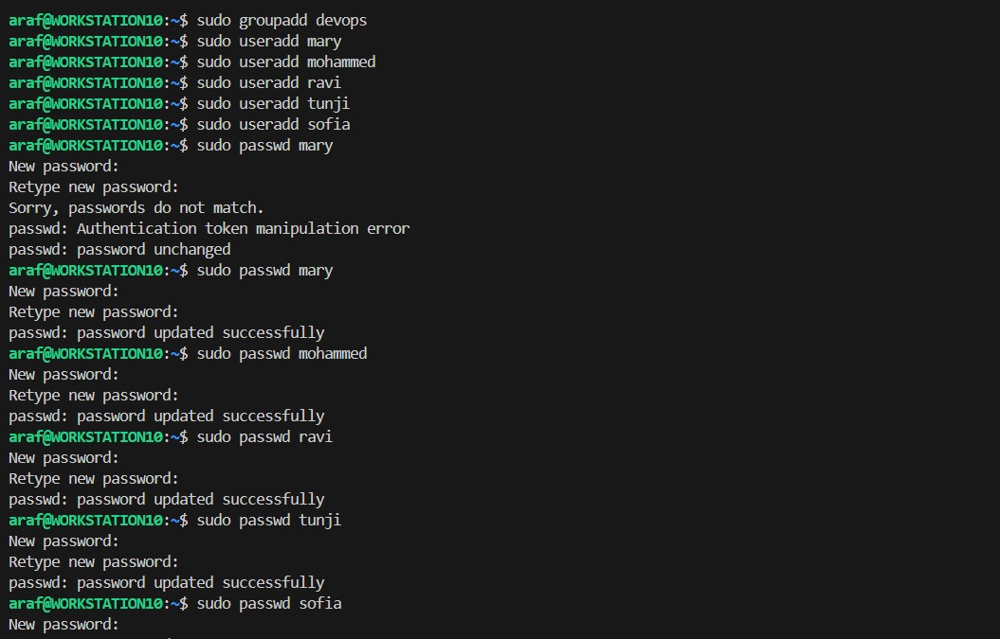

Add the users to the `devops` group using the command `sudo usermod -aG devops mary mohammed ravi tunji sofia`.
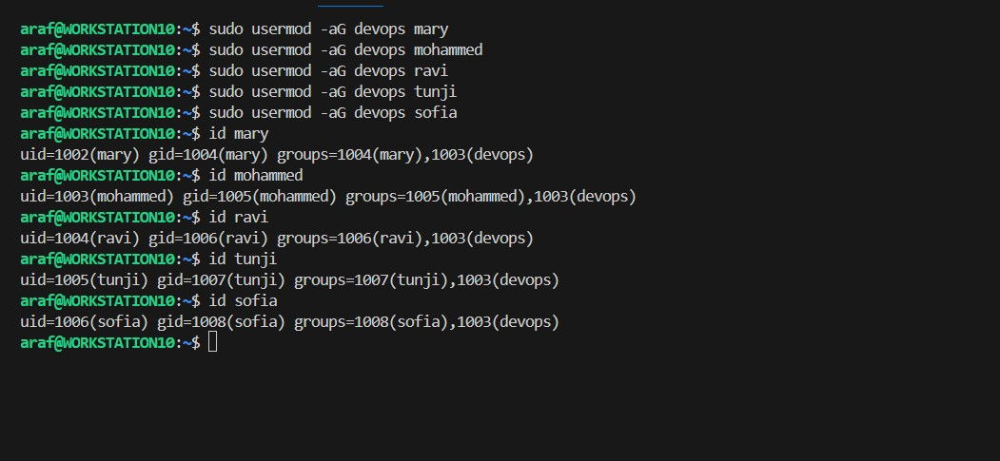

Create a folder for each user in the /home directory using the command `sudo mkdir /home/mary /home/mohammed /home/ravi /home/tunji /home/sofia`.
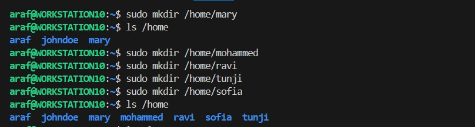

Each folder created should belong to the devops group using the command `sudo chown :devops /home/mary /home/mohammed /home/ravi /home/tunji /home/sofia`.
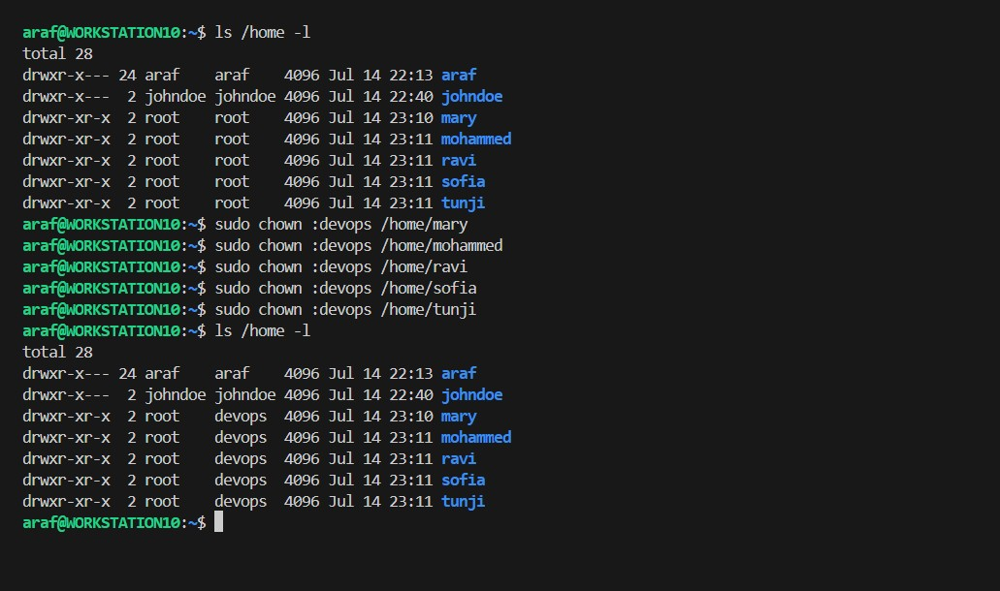